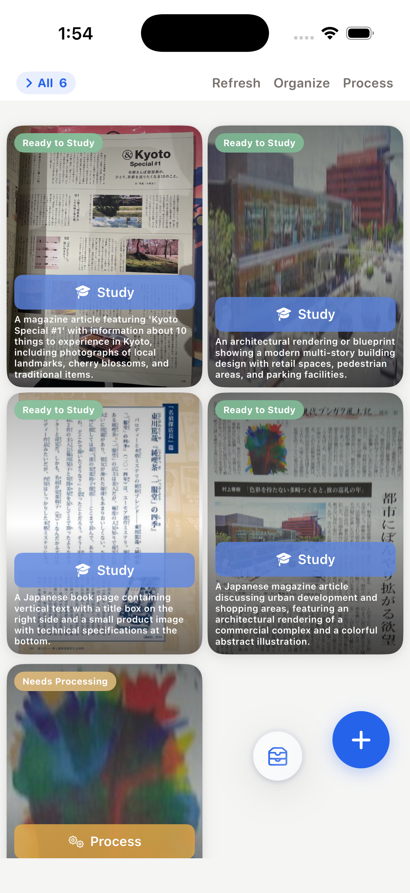

# Fudo (筆道)

**The annotation overlay your iOS simulator didn't ask for, but definitely deserves.**

Because sometimes you need to draw a big red box around the bug and say "this. fix this."

> "I could just describe the bug in words" — a human who wasted 20 minutes typing what a single screenshot could show



## What it does

Fudo is a transparent overlay that floats on top of your iOS Simulator. You draw on it. You annotate it. You screenshot it. You hand it to your agent. The agent actually understands what you mean for once.

- Transparent canvas overlay — position it over the simulator
- Bounding boxes with dotted/dashed/solid styles
- Freehand drawing and text annotations
- Color picker with presets + custom colors
- Screenshot captures everything (simulator + your annotations)
- CLI API at `localhost:17321` — your agent can trigger screenshots without asking
- `Cmd+M` to collapse the frame and interact with the simulator
- Keyboard shortcuts: `S`elect, `B`ox, `P`en, `T`ext

## Install

### Prerequisites

- macOS
- [Rust](https://rustup.rs/)
- Node.js 18+

### Build & install

```bash
git clone https://github.com/embit087/Fudo.git
cd Fudo
npm install
npm run tauri build
cp -R "src-tauri/target/release/bundle/macos/Fudo.app" /Applications/
```

### Fish shell command (optional)

Drop [`fudo.fish`](https://github.com/embit087/Fudo/blob/main/fudo.fish) into `~/.config/fish/functions/` and run `fudo` from any terminal to trigger a screenshot — it talks to the app if running, falls back to raw `xcrun simctl` if not.

## Agent integration

Fudo exposes a local HTTP API so your coding agent can capture annotated screenshots without interrupting your flow.

### For Claude Code

Add this to your project's `CLAUDE.md` or agent instructions:

```markdown
## Fudo (screenshot tool)

The human uses Fudo to annotate the iOS simulator. When the human shares
a screenshot or says "look at this", check if Fudo is running:

  curl -s http://localhost:17321/health

To capture what the human sees (with their annotations):

  curl -s http://localhost:17321/screenshot

To save to a specific path:

  curl -s "http://localhost:17321/screenshot?path=/tmp/screenshot.png"

The response includes the screenshot path and simulator context
(current view name + relevant source files). Use this to understand
exactly what the human is pointing at.
```

### API reference

```bash
# Is the human's overlay running?
curl http://localhost:17321/health
# → {"status":"ok","port":17321}

# Capture annotated screenshot (auto-saves to Desktop)
curl http://localhost:17321/screenshot
# → {"path":"/Users/.../Desktop/ios-annotate-123.png","sim":{...}}

# Capture with custom path
curl "http://localhost:17321/screenshot?path=/tmp/annotated.png"
```

The `/screenshot` response includes:
- `path` — where the annotated screenshot was saved
- `sim.sim_screenshot` — raw simulator screenshot path (no annotations)
- `sim.view` — current app view name (e.g. "profile", "explore")
- `sim.files` — relevant source files for that view

### The workflow

1. Human opens Fudo, overlays it on the simulator
2. Human draws bounding boxes around the problem area
3. Human types `fudo` in terminal (or agent calls the API)
4. Agent gets the screenshot + context + source file paths
5. Agent actually knows what to fix
6. Profit

> The gap between "I see the bug" and "the agent sees the bug" is one `curl` command.

## Keyboard shortcuts

| Key | Action |
|-----|--------|
| `S` | Select — move, resize, or click shapes |
| `B` | Box — draw a bounding box (toggle) |
| `P` | Pen — freehand draw (toggle) |
| `T` | Text — click to type a note (toggle) |
| `Cmd+M` | Collapse/expand the frame |
| `Cmd+Z` | Undo |
| `Delete` | Remove selected shape |
| `Esc` | Deselect / close popover |

## Tech

Tauri v2 + React + TypeScript. Runs native on macOS. No Electron. No web server. Just a 5MB binary that does exactly one thing well.

## License

MIT — do whatever you want with it.

## Author

jwu322
